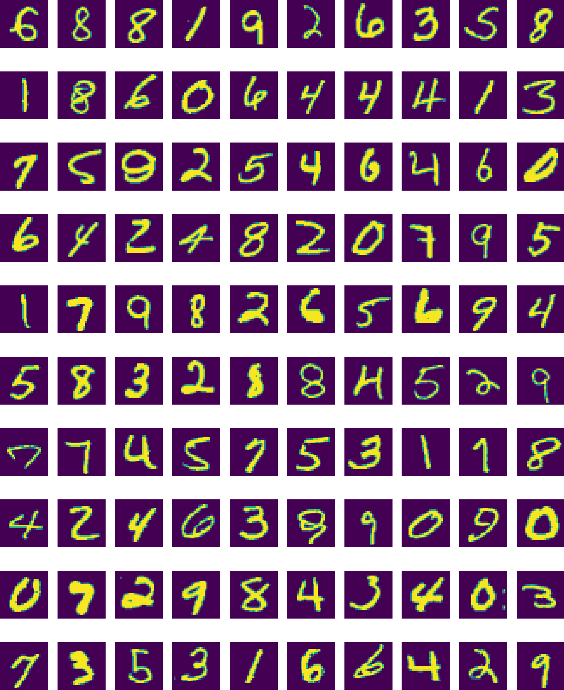
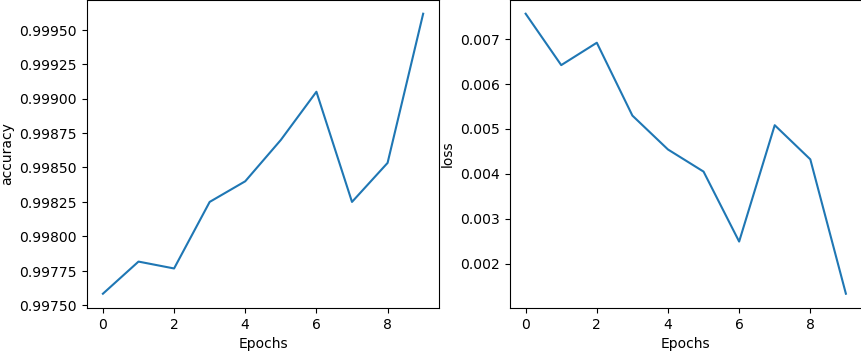

# DIGIT_Classification

This repository demonstrates the use of Artificial Neural Networks (ANN) and Convolutional Neural Networks (CNN) for digit image classification. The project compares both models in terms of accuracy and loss across multiple epochs using a standard image dataset (such as MNIST).

## Overview
This project applies two distinct neural network architectures to classify digit images:
1. **ANN (Artificial Neural Network)**: A fully connected network.
2. **CNN (Convolutional Neural Network)**: A network that leverages convolution layers for spatial feature extraction.

The training results are presented by comparing:
- **Accuracy** at each epoch.
- **Loss** at each epoch.

## Features
- Implementation of both ANN and CNN for image classification.
- Visualization of accuracy and loss over epochs for both models.
- Comparison between the performance of ANN and CNN models.

## Requirements
Make sure you have the following installed:
- Python 3.x
- TensorFlow/Keras
- NumPy
- Matplotlib
## Result
### MNIST Dataset Images

## Incorrect Predictions
### FFD Incorrect Predictions

### CNN Incorrect Predictions

## Accuracy and Loss
### FFD Accuracy and Loss

### CNN Accuracy and Loss

